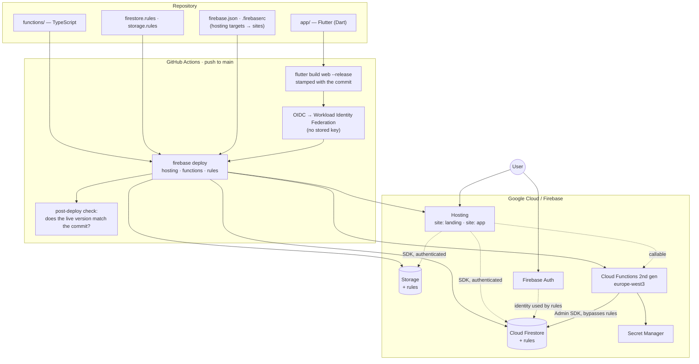

# Stack blueprint — Flutter + Firebase, deployed keyless from GitHub

**Running in:** two production projects.
**Shape:** one Dart codebase that ships as a web app today and as iOS/Android later, a
managed backend with no servers to operate, and a deploy that runs on every merge to `main`
without a single long-lived credential existing anywhere.

**Who this is for:** a small team — often one founder and a set of agents — that needs a
product live in front of users this week, and cannot afford an afternoon of infrastructure
per feature.

## The whole programme

Building the app is the part that is easy to start. These five files are the rest of it —
the work that decides whether the product runs and can legally be published.

| | Covers |
|---|---|
| **This file** | The building blocks, what was deliberately not chosen, the architecture, the repository layout |
| [`auth-and-data.md`](auth-and-data.md) | Anonymous-to-linked sign-in, the demo/no-backend switch, the four security-rule shapes, Storage, data-model conventions, emulators |
| [`payments.md`](payments.md) | Client sends an id and nothing else; signed idempotent webhook; grant and record in one transaction; refunds and revocation; test/live secret separation |
| [`observability.md`](observability.md) | Error reporting (the piece most often missing entirely), the visible build id, analytics behind one consent gate, what to check after every deploy |
| [`keyless-deploy.md`](keyless-deploy.md) | Merge to production with no stored credential — the OIDC exchange, the one-time setup, and the table of failures already paid for |
| [`ops-watch.md`](ops-watch.md) | Watching the deploy path and the runtime **without any human login** — public signals, a scheduled read-only CI watch that files issues into the backlog, managed uptime checks |
| [`going-live.md`](going-live.md) | Legal pages, account deletion, caching and service workers, the pre-launch checklist, store submission |

---

## The building blocks

| Layer | Choice | Version in use | Why this one |
|---|---|---|---|
| App | **Flutter** (Dart) | stable channel | One codebase for web + iOS + Android. Web ships first; the app stores come later without a rewrite. |
| State | `flutter_riverpod` | ^2.5 | Compile-time-safe DI, testable without a widget tree. |
| Routing | `go_router` | ^14 | Declarative, deep-link and URL friendly — required for a real web build. |
| Auth | `firebase_auth` | ^6 | Anonymous → linked account without a migration; the "try it before signing up" path. |
| Data | `cloud_firestore` + `firestore.rules` | ^6 | Realtime by default. The **security rules are the authorisation layer**, not the client. |
| Files | `firebase_storage` + `storage.rules` | ^13 | Same identity, same rules model. |
| Push | `firebase_messaging` | ^16 | Web push and mobile push through one API. |
| Server logic | **Cloud Functions 2nd gen**, TypeScript | Node **22**, `firebase-functions` ^7, `firebase-admin` ^14 | Anything the client must not be trusted with: payment, entitlement, third-party keys. |
| Region | `europe-west3` | — | Data stays in the EU; latency for European users. Set once, painful to change later. |
| Payments | **Stripe** via a callable Function | `stripe` ^17 | The client sends a product id only. Price and entitlement are decided server-side. |
| Secrets | **Google Secret Manager** via `defineSecret` | — | No secret in the repo, none in the workflow, none in a `.env`. |
| Hosting | **Firebase Hosting**, multi-target | — | Marketing site and app on separate sites, one config, one deploy. |
| CI/CD | **GitHub Actions** | — | Push to `main` → build → deploy → verify. |
| Deploy auth | **Workload Identity Federation** (OIDC) | `google-github-actions/auth@v2` | No service-account key exists to leak. See [`keyless-deploy.md`](keyless-deploy.md). |

### Deliberately not chosen

- **A separate backend service** (Cloud Run, Express, Nest). Firestore rules plus a handful
  of Functions covered every case so far. A backend is a thing to operate; the day one is
  genuinely needed, it goes in beside this, not instead of it.
- **A static `FIREBASE_TOKEN` or a service-account JSON key in GitHub secrets.** Both work
  on the first afternoon and are a permanent liability afterwards. WIF costs one script.
- **`functions.config()`** — removed in `firebase-functions` v7. Parameters (`defineString`,
  `defineSecret`) are the replacement and behave differently in CI; see the failure table in
  [`keyless-deploy.md`](keyless-deploy.md).
- **Separate repos for app and functions.** One repo means one commit can change the client,
  the rules and the server function together, and one deploy ships all three consistently.

---

## How it fits together



Two things in that picture carry most of the weight:

1. **The client talks to Firestore directly**, and the only thing standing between a user and
   someone else's data is `firestore.rules`. Every rules change is a security change and goes
   through the security gate (`/dev-security`).
2. **Cloud Functions run as the default Compute Engine service account**, not as the deployer.
   That single fact is behind roughly half of the failure modes in `keyless-deploy.md`.

---

## Repository layout

```
app/                    Flutter application
  lib/                    source
  test/                   widget + unit tests
  build/web/              build output — the `app` hosting target serves this
functions/              Cloud Functions (TypeScript)
  src/index.ts            entry point; defineSecret / defineString live here
  package.json            engines.node pins the runtime
web/  or  prototype/    static marketing / prototype site — its own hosting target
firestore.rules         authorisation for the database
firestore.indexes.json  composite indexes — deployed, not clicked together in the console
storage.rules           authorisation for files
firebase.json           what each hosting target serves; functions predeploy hook
.firebaserc             which target maps to which Hosting site
scripts/
  setup-keyless-deploy.sh   one-time IAM setup (this blueprint)
.github/workflows/
  deploy-main.yml           push to main → build, deploy, verify
```

**`firebase.json` + `.firebaserc` are a pair.** `firebase.json` says what a target serves;
`.firebaserc` says which Hosting site that target *is*. A deploy that goes to the wrong site
is almost always a `.firebaserc` that was never applied — `firebase target:apply` is a
one-time step per site and is easy to forget on a new machine.

---

## Conventions that travel with this stack

- **Node runtime is pinned in `functions/package.json` → `engines.node`.** `firebase.json`
  carries no `runtime` field. One place, not two.
- **Functions region is set once**, globally (`setGlobalOptions`) rather than per function,
  so a new function cannot silently land in `us-central1`.
- **Callable functions that must be publicly reachable declare `invoker: "public"` in code**,
  not with a `gcloud` command after the deploy. A manual post-deploy step is a step that gets
  skipped, and the symptom is a `401` that looks like an auth bug in the client.
- **The web build is stamped with the commit** (`--dart-define=BUILD_ID=…`, served as
  `version.json`), so the post-deploy check can prove the new version is actually live.
  Without a stamp, "deploy succeeded" only means the command exited zero.
- **Caching headers are explicit in `firebase.json`.** `index.html`, `flutter_bootstrap.js`,
  `flutter_service_worker.js` and `version.json` must not be cached, or users keep the old
  app after a deploy and the bug reports describe a version that no longer exists.
- **Anything a user must not be able to fake is server-side.** Prices, entitlements,
  quotas — the client sends an identifier, never an amount.

---

## Getting a new project onto this stack

1. `/dev-stack firebase-flutter` — writes the setup script, the deploy workflow and the
   deployment documentation into the project with its own project id and repository filled in.
2. Create the Firebase project and enable **Blaze** billing (2nd-gen Functions require it).
3. Create the Hosting sites and apply the targets:
   ```bash
   firebase hosting:sites:create PROJECT-app --project PROJECT_ID
   firebase target:apply hosting app PROJECT-app --project PROJECT_ID
   ```
4. `gcloud auth login` as a project owner, then `./scripts/setup-keyless-deploy.sh` once.
5. Push to `main`. Read [`keyless-deploy.md`](keyless-deploy.md) **before** the first deploy
   fails, not after — the failure table there covers every wall both projects hit.
