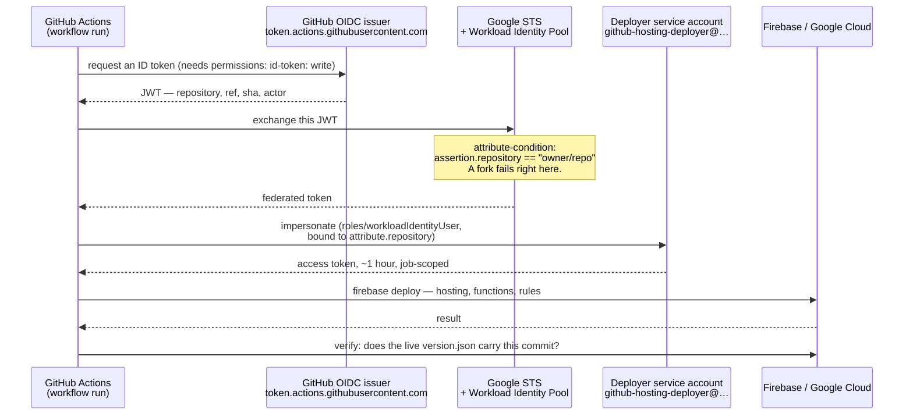

# Keyless deployment — GitHub Actions → Google Cloud, without a stored key

Every push to `main` builds and deploys. No service-account JSON key exists, no
`FIREBASE_TOKEN` is stored, and there is nothing in GitHub secrets to rotate or to leak.

The mechanism is **Workload Identity Federation** (WIF): GitHub issues the workflow a
short-lived OIDC token that says *"this run is repository X, branch Y"*. Google is configured
to trust that issuer, and only for that exact repository. It exchanges the token for a
credential that lives for the length of the job.

The values in the workflow — provider path and service-account e-mail — are **not secrets**.
Publishing them changes nothing: access is restricted on Google's side by the provider's
attribute condition. Someone who forks the repository gets a token that says a different
repository, and the exchange fails.

---

## The exchange, step by step



Two independent locks, both server-side:

1. **The provider's attribute condition** decides whose token is accepted at all.
2. **The `principalSet` binding on the service account** decides which repository may
   impersonate the deployer.

Neither can be bypassed by changing the workflow file, which is why the workflow may be read
by anyone.

---

## What runs where

| Identity | What it does | Common mistake |
|---|---|---|
| **Deployer SA** (`github-hosting-deployer@…`) | Runs `firebase deploy`. Uploads Hosting, submits the Functions build, writes rules and indexes. | Assuming it also *runs* the functions. It does not. |
| **Default Compute Engine SA** (`PROJECT_NUMBER-compute@developer…`) | **Builds and runs** 2nd-gen Cloud Functions. Its identity is what the Admin SDK uses at runtime. | Since ~Sept 2024 it is no longer granted Editor automatically on new projects. Everything it needs must be granted explicitly. |

Roughly half of all first-deploy failures on this stack are this table being one row shorter
in someone's head than in reality.

---

## One-time setup

```bash
gcloud auth login          # an account with roles/owner on the project
./scripts/setup-keyless-deploy.sh
```

The script is **idempotent** — running it again is safe and is the correct first move
whenever a deploy fails on a permission. It derives the project id from `.firebaserc` and
the repository from the `origin` remote, so there is nothing to edit and nothing to get
wrong when a second project adopts it.

What it does:

1. Enables the APIs the deploy touches — including the ones only reached indirectly, such as
   Eventarc and Pub/Sub for Functions triggers.
2. Creates the deployer service account and grants it the deploy roles.
3. Grants the **default Compute Engine SA** its build and runtime roles.
4. Creates the Workload Identity Pool and an OIDC provider bound to this one repository.
5. Allows only that repository to impersonate the deployer.
6. Prints the two values that go into the workflow.

It changes IAM, so it is run by a human, once, not by an agent inside the loop.

---

## The workflow

[`deploy-main.yml`](deploy-main.yml) — copy into `.github/workflows/`. Its shape:

```
checkout → build Flutter web (stamped with the commit) → npm ci for functions
        → authenticate (WIF) → deploy hosting targets explicitly
        → deploy rules → deploy functions → verify the live version
```

Three details in there are the result of specific incidents, not style:

- **Hosting targets are named explicitly** (`--only hosting:app,hosting:landing`) instead of
  a blanket `--only hosting`. The log then says what went where, and a target added later
  cannot go live unnoticed by riding along with an unrelated deploy.
- **The build is stamped and verified afterwards.** A deploy is not done when the command
  exits — it is done when the new version answers. Silent non-deploys otherwise surface days
  later, by accident, in the Actions list.
- **`id-token: write`** is required on the job, and is the single most common reason the very
  first WIF run fails.

---

## Failure modes — every one of these actually happened

Each row: the message as it appears, what is really wrong, and the fix.

| Error | Cause | Fix |
|---|---|---|
| `Missing required permission … cloudfunctions.functions.setIamPolicy is required to deploy: <fn>` | Deploying a **new public HTTPS function** sets an IAM policy on it. `roles/cloudfunctions.developer` may update existing functions but may not do that. | Deployer SA needs `roles/cloudfunctions.admin`. `developer` is enough only until the first public endpoint. |
| `Permission 'secretmanager.secrets.get' denied` — *after Hosting already deployed* | A function pulls a secret via `defineSecret`. The deploy must read it **and** bind the runtime identity as `secretAccessor`, which needs `secrets.setIamPolicy`. | Deployer SA needs `roles/secretmanager.admin`. `viewer` is not enough. Note the failure order: the run is red while the sites are already live. |
| `In non-interactive mode but have no value for the following environment variables: X` — although `X` has a default in the code | `firebase-tools` resolves parameters **only** from dotenv files in the functions folder (`.env`, `.env.<projectId>`, `.env.<alias>`). The non-interactive branch throws *before* `param.default` is read — a default is a prompt suggestion, not a CI source. `process.env` is not consulted, and `--force` does not help. | Write the value into `functions/.env` **during the run**, from a step-level `env:`. Do not check that file in — it becomes a magnet for secrets. Real secrets belong in Secret Manager. |
| `missing permission on the build service account` | 2nd-gen Functions build as the **default Compute Engine SA**, which no longer gets Editor automatically. | Grant it `cloudbuild.builds.builder`, `artifactregistry.writer`, `storage.objectViewer`, `logging.logWriter`. |
| `PERMISSION_DENIED` at **runtime**, on the function's own Firestore writes | Same identity, different phase: the runtime SA has no Firestore access. | Grant the Compute SA `roles/datastore.user`. |
| Callable function returns `401` before the code runs | `onCall` requires `allUsers` as `roles/run.invoker`. | Declare `invoker: "public"` in the function options so every deploy sets it. Never a manual `gcloud` step afterwards — it will be skipped on the next project. |
| `Error: Unable to authenticate` / `the workflow is requesting 'id-token: none'` | The job cannot request an OIDC token. | `permissions: { contents: read, id-token: write }` on the job. |
| The exchange fails with the repository in the message | The provider's attribute condition names a different repository — usually a copied workflow whose setup script was never run for the new project. | Re-run `setup-keyless-deploy.sh` in the new project; it derives the repository from `origin`. |
| Deploy is green, users still see the old app | Service worker and `index.html` were served from cache. | Explicit `Cache-Control` headers in `firebase.json` for `index.html`, `flutter_bootstrap.js`, `flutter_service_worker.js`, `version.json`. |
| Deploy is green, the new version is not live at all | Nothing verified it. | The verify job: fetch `version.json` and compare it with `github.sha`. |
| Deploy fails on an unchanged Functions deploy: `… is the current active version` | Re-deploying an identical revision. | Treat that specific message as success — the workflow does. |
| Deploy warns that the Node runtime is deprecated | Runtime end-of-life is announced months ahead and then enforced. | Bump `engines.node` in `functions/package.json` when the warning appears, not when it becomes an error. `firebase.json` carries no runtime field — `engines` is the single source. |

**When a deploy fails in a way that is not in this table, the fix belongs in this table.**
Write a learning with `scope: upstream` and run `/dev-learn --upstream`; once merged, every
project on this blueprint has it before it hits the same wall.

---

## Security notes

- **No long-lived credential exists.** The token is minted per job and expires with it. There
  is no key to rotate, no key to accidentally commit, and nothing useful in a stolen backup
  of the repository.
- **Scoped to one repository.** The attribute condition and the `principalSet` binding both
  name it. A fork cannot deploy; neither can another repository in the same organisation.
- **Restrict the branch too, if the project needs it.** The condition can additionally require
  `assertion.ref == 'refs/heads/main'`. Do that when the repository accepts pull requests from
  people who should not be able to reach production.
- **The deployer never holds application secrets.** It is allowed to *bind* Secret Manager
  secrets to the runtime identity; it is not a path to read them into a log.
- **Least privilege has a floor here.** The roles in the setup script are the minimum both
  production projects converged on after removing everything that turned out to be optional.
  Removing more is possible — measure it against the table above before doing so.
