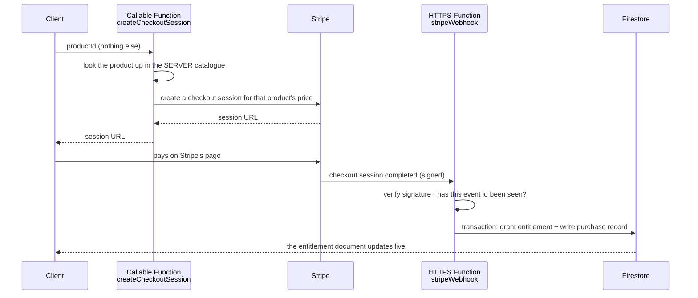

# Payments — Stripe through Cloud Functions

The rule the whole design serves: **the client never says what something costs and never says
what it may have.** It sends a product identifier. Everything else is decided on the server
and written by the server.

If you take one thing from this file, take the pairing: `allow write: if false` on the
entitlement document (see [`auth-and-data.md`](auth-and-data.md)) plus a signed, idempotent
webhook. Either one alone is decoration.

---

## The flow



The client learns it has been granted something by **watching its own entitlement document**,
not from the callable's return value and not from a redirect parameter. A redirect can be
replayed; a Firestore listener reflects what the server actually wrote.

---

## The four properties the webhook must have

**1. Signature verification.** Only requests signed with the webhook signing secret are
processed. Without it the endpoint is an open "grant me things" button on the public
internet, and it will be found.

**2. Idempotency.** Stripe delivers the same event more than once — retries on timeout,
manual resends, network partitions. Processed event ids are written to a server-only
collection and checked first. Give that collection a **TTL policy** (30–90 days), or it grows
forever as a permanent record of every payment event.

**3. Atomicity.** The entitlement grant and the purchase record are written in **one
transaction**. Two sequential writes leave a window where the user is granted access with no
record of why — and that record is the only bridge from a later refund back to the account.

**4. Traceability.** Store, with the grant: the uid, the product id, what was granted, and
whether it is still active. Stripe's refund and dispute events carry the payment reference —
not your uid and not your product id. Without your own record, a refund cannot be matched to
an account, and a refunded customer keeps what they paid for.

---

## Two truths, deliberately kept apart

| Truth | Owner | Consequence |
|---|---|---|
| **What is charged** | the Stripe dashboard product's price | changing a price is a business action, not a deploy |
| **What is granted** | the server catalogue in code | changing an entitlement is a reviewed code change |

They can drift. When they do, **log loudly and do not block the purchase** — the dashboard
decides what is charged, and refusing a payment because a constant in the code disagrees is
the worse failure. A logged drift means the catalogue and the published price list have to
catch up.

---

## Refunds, disputes, revocation

Handle `charge.refunded` and `charge.dispute.*`, not only the happy path. A product that can
be bought but not un-bought will eventually grant a chargeback artist permanent access.

Resolve the grant to revoke from the **stored purchase record** first, and only fall back to
the catalogue. If the product was later removed from the catalogue — a normal thing when the
range changes — a catalogue-only lookup cannot resolve it and the refunded customer keeps the
content. The stored fields came from the same server transaction as the grant, so they are
exactly as trustworthy as the catalogue was on the day.

**Purchase records survive account deletion.** Commercial and tax retention periods require
it, and a chargeback must still be attributable months later. Say so explicitly in the
privacy policy — see [`going-live.md`](going-live.md).

---

## Secrets and environments

Secrets are declared in code with `defineSecret` and stored in **Google Secret Manager**.
They are never in the repository, never in the workflow, never in a `.env`.

```bash
firebase functions:secrets:set STRIPE_SECRET_KEY
firebase functions:secrets:set STRIPE_WEBHOOK_SECRET
```

**Keep test and live credentials separate, and select them by environment** — a secret key
and a webhook secret per mode, so preview and staging run against Stripe's test mode while
only production touches live. The failure this prevents is not subtle: a preview environment
wired to live keys takes real money from a real card during a QA pass.

Deploy consequence: the deployer service account needs `roles/secretmanager.admin`, because
the deploy binds the runtime identity to each secret. See the failure table in
[`keyless-deploy.md`](keyless-deploy.md) — this is the one that fails *after* Hosting has
already gone live.

---

## Testable without Stripe, without an emulator

Keep the decision logic — signature handling, idempotency, drift comparison, revocation —
in **plain modules with no Firebase and no Stripe imports**, and have the function be a thin
shell around them. Then the interesting cases are unit tests that run in milliseconds:
duplicate event, unsigned request, refund of a product no longer in the catalogue, price
drift. That is the difference between a payment path that is tested and one that is hoped
about.

Before going live, run the whole path once in Stripe's test mode with a test card, including
the webhook, and confirm the entitlement document changes.

---

## The commercial prerequisites

These are not optional extras — a payment flow without them is not lawfully sellable in the
EU, and the app stores check for them:

- **Terms and conditions URL** registered in the Stripe dashboard, so it appears on the
  checkout page.
- **E-mail receipts** enabled.
- **Right of withdrawal** (Widerrufsrecht) stated, including how it interacts with digital
  content delivered immediately.
- **Price list published** and matching the catalogue — this is what the drift log protects.

---

## What this design does *not* guarantee

State it plainly wherever the payment path is documented, because the gap is where the
incidents live:

- It does not protect against a compromised Stripe account.
- It does not make the client's *display* of what it owns authoritative — the entitlement
  document is, and the UI must read it rather than cache a purchase result.
- It does not cover subscriptions unless you also handle
  `customer.subscription.deleted` and payment failure. A subscription that can lapse but
  never revokes is the same bug as a refund that never revokes.
